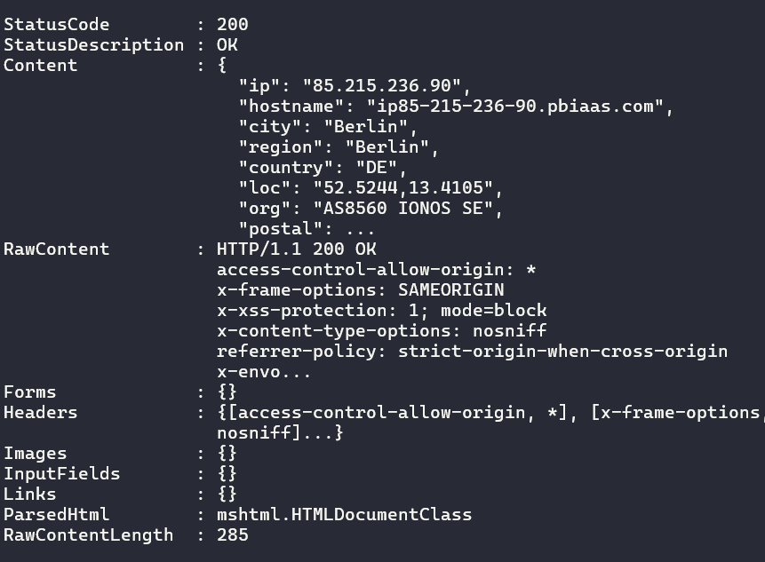

<!--
Text can be **bold**, _italic_, ~~strikethrough~~ or `keyword`.


[Link to another page](another-page).

There should be whitespace between paragraphs.

There should be whitespace between paragraphs. We recommend including a README, or a file with information about your project.
-->

# [](#header-1) Setup your own VPN Server

## [](#header-2) What is VPN ?

Certainly! VPN stands for Virtual Private Network. It's a service that allows you to create a secure connection to another network over the internet. This connection is encrypted, which means that data passing between your device and the VPN server is secure and protected from prying eyes.

Here's how it works:


<br/>
<br/>
Encryption: When you connect to a VPN server, your device creates a secure, encrypted tunnel to that server. This encryption ensures that any data transmitted between your device and the VPN server is scrambled and unreadable to anyone who might intercept it.

IP Address Masking: Your internet traffic appears to come from the VPN server rather than your own device. This masks your IP address, making it more difficult for websites and online services to track your location or identify you.

Security and Privacy: VPNs provide an extra layer of security when using public Wi-Fi networks, such as those in cafes, airports, or hotels. Without a VPN, your data could be vulnerable to interception by hackers on these networks. Additionally, VPNs can help protect your privacy by preventing your internet service provider (ISP) from monitoring your online activity.

Bypassing Geographic Restrictions: Some websites and online services restrict access based on your geographical location. By connecting to a VPN server in a different country, you can bypass these restrictions and access content that might otherwise be unavailable to you.

Anonymity: While VPNs can enhance privacy and security, it's important to note that they do not make you completely anonymous online. Your VPN provider can still see your activity, and if you log into accounts or provide personal information, that information could still be traced back to you.

# [](#header-2) Requirements

To build a VPN server we need ... a server ! I've a VPS located in Germany with which i'm going to create my VPN server on. You have a lot of VPS provider, for example I recommend a provider that let you have a full root access on the server without any constraint like port restriction. It's usefull to have a part of freedom and avoid access/action issue depending of your provider. Hostinger has a nice plans. Check this list to find the plan you looking for
<a src="https://cybernews.com/best-web-hosting/vps-hosting/"> here </a>

In my case, I've bought a VPS server with Ubuntu 22.04 image installed. I think it's the most adapted OS to easily achieve our project. But in this tutorial, I believe you can realized the same result with any other linux distribution.


<br/>

We also need a VPN client to etablish a connection between my device and the VPN server. I recommend <a src="https://openvpn.net/client/client-connect-vpn-for-windows/"> OpenVPN connect </a>

# [](#header-2) Install OpenVPN

OpenVPN is a Virtual Private Networking (VPN) solution provided in the Ubuntu Repositories. It is flexible, reliable and secure. It belongs to the family of SSL/TLS VPN stacks (different from IPSec VPNs). This chapter will cover installing and configuring OpenVPN to create a VPN.

* Let's connect to our VPS

```cs 
ssh root@85.215.236.90
```
* Install OpenVPN

```cs 
apt update && apt -y install ca-certificates wget net-tools gnupg

wget https://as-repository.openvpn.net/as-repo-public.asc -qO /etc/apt/trusted.gpg.d/as-repository.asc

echo "deb [arch=amd64 signed-by=/etc/apt/trusted.gpg.d/as-repository.asc] http://as-repository.openvpn.net/as/debian jammy main">/etc/apt/sources.list.d/openvpn-as-repo.list

apt update && apt -y install openvpn-as
```

At end of installation you should have a message that inform you how to acces admin platform.

<br/>

<br/>

In my case, let's connect to my panel admin from 
https://85.215.236.90:943/admin


<br/>

<br/>

Just type your credentials and log in your WebUI interface.

# Configuration

Well, we've installed OpenVPN, now let's do a configuration.
We create one user witn admin right. OpenVPN has free plan that allow two users connected in same time. You have to upgrade the plan if you want manager more connections.
Asign a password to this user by clicking on "More settings"

<br/>


<br/>

Then, create a new user profile. It will generate a ovpn file. 

<br/>

<br/>

# Test connection

Open your OpenVPN Connect app. Import the profile that you have just created in the previous step.


<br/>

<br/>

Then enter the password for the user concerned. You should have etablished the connection.


<br/>

Let's see our status connection with several informations

<br/>

```cs
curl ipinfo.io
```
<br/>




# References
* [https://www.kaspersky.com/resource-center/definitions/what-is-a-vpn](https://www.kaspersky.com/resource-center/definitions/what-is-a-vpn)
* [https://as-portal.openvpn.com/instructions/ubuntu/installation](https://as-portal.openvpn.com/instructions/ubuntu/installation)
* [https://ubuntu.com/server/docs/service-openvpn](https://ubuntu.com/server/docs/service-openvpn)
